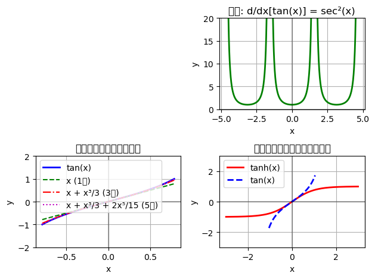

```python

```

# User
详细介绍y=tanx，并对其进行拓展

# Assistant
# Anaconda Assistant: 详细介绍 y = tan(x) 及其拓展

## 基本介绍

正切函数 y = tan(x) 是三角函数中的一个基本函数，定义为：

tan(x) = sin(x) / cos(x)

其中 x 是角度（通常以弧度表示）。

### 主要特性：
- **周期性**：tan(x) 的周期是 π（180度）
- **定义域**：x ≠ (n + 1/2)π，其中 n 是整数（在这些点上函数不存在）
- **值域**：(-∞, +∞)
- **奇函数**：tan(-x) = -tan(x)
- **在 x = 0 处的值**：tan(0) = 0
- **渐近线**：x = (n + 1/2)π，其中 n 是整数

## 图形可视化与拓展

下面我将使用 Python 代码来可视化正切函数并展示一些拓展应用：


```python
# Assistant
import numpy as np
import matplotlib.pyplot as plt
import math  # Import math for factorial function

# First line was missing 'f' in 'for'
for n in range(-1, 2):
    plt.axvline(x=(n+0.5)*np.pi, color='r', linestyle='--', alpha=0.5)
plt.title('y = tan(x)')
plt.xlabel('x')
plt.ylabel('y')
plt.ylim(-10, 10)

# 2. 正切函数的导数
plt.subplot(2, 2, 2)
x = np.linspace(-1.5*np.pi, 1.5*np.pi, 1000)
# 避开不连续点
mask = np.abs(np.cos(x)) > 0.05
# tan(x)的导数是sec²(x) = 1/cos²(x)
plt.plot(x[mask], 1/(np.cos(x[mask])**2), 'g-', linewidth=2)
plt.grid(True)
plt.axhline(y=0, color='k', linestyle='-', alpha=0.3)
plt.axvline(x=0, color='k', linestyle='-', alpha=0.3)
plt.title('导数: d/dx[tan(x)] = sec²(x)')
plt.xlabel('x')
plt.ylabel('y')
plt.ylim(0, 20)

# 3. 正切函数的幂级数展开（泰勒级数）
plt.subplot(2, 2, 3)
x = np.linspace(-np.pi/4, np.pi/4, 1000)
# 正切函数的泰勒展开（前几项）
def tan_taylor(x, terms=5):
    result = 0
    bernoulli_nums = [0, 1/6, 0, -1/30, 0, 1/42, 0, -1/30]
    for n in range(1, terms+1):
        if n <= len(bernoulli_nums)-1:
            # Fixed: replaced (2*n)! with math.factorial(2*n)
            coef = 2**(2*n) * (2**(2*n) - 1) * bernoulli_nums[n] / math.factorial(2*n)
            result += coef * x**(2*n-1)
    return result

# 计算不同阶数的泰勒展开
plt.plot(x, np.tan(x), 'b-', linewidth=2, label='tan(x)')
plt.plot(x, x, 'g--', linewidth=1.5, label='x (1阶)')
plt.plot(x, x + x**3/3, 'r-.', linewidth=1.5, label='x + x³/3 (3阶)')
plt.plot(x, x + x**3/3 + 2*x**5/15, 'm:', linewidth=1.5, label='x + x³/3 + 2x⁵/15 (5阶)')
plt.grid(True)
plt.axhline(y=0, color='k', linestyle='-', alpha=0.3)
plt.axvline(x=0, color='k', linestyle='-', alpha=0.3)
plt.title('正切函数的泰勒级数展开')
plt.xlabel('x')
plt.ylabel('y')
plt.legend()
plt.ylim(-2, 2)

# 4. 双曲正切函数 tanh(x) 对比
plt.subplot(2, 2, 4)
x = np.linspace(-3, 3, 1000)
plt.plot(x, np.tanh(x), 'r-', linewidth=2, label='tanh(x)')
# 在有限范围内绘制tan(x)进行对比
x_tan = np.linspace(-np.pi/3, np.pi/3, 1000)
plt.plot(x_tan, np.tan(x_tan), 'b--', linewidth=2, label='tan(x)')
plt.grid(True)
plt.axhline(y=0, color='k', linestyle='-', alpha=0.3)
plt.axvline(x=0, color='k', linestyle='-', alpha=0.3)
plt.title('正切函数与双曲正切函数对比')
plt.xlabel('x')
plt.ylabel('y')
plt.legend()
plt.ylim(-3, 3)

plt.tight_layout()
plt.show()
```

    /tmp/ipykernel_1220/1152801544.py:15: MatplotlibDeprecationWarning: Auto-removal of overlapping axes is deprecated since 3.6 and will be removed two minor releases later; explicitly call ax.remove() as needed.
      plt.subplot(2, 2, 2)
    /tmp/ipykernel_1220/1152801544.py:73: UserWarning: Glyph 23548 (\N{CJK UNIFIED IDEOGRAPH-5BFC}) missing from current font.
      plt.tight_layout()
    /tmp/ipykernel_1220/1152801544.py:73: UserWarning: Glyph 25968 (\N{CJK UNIFIED IDEOGRAPH-6570}) missing from current font.
      plt.tight_layout()
    /tmp/ipykernel_1220/1152801544.py:73: UserWarning: Glyph 27491 (\N{CJK UNIFIED IDEOGRAPH-6B63}) missing from current font.
      plt.tight_layout()
    /tmp/ipykernel_1220/1152801544.py:73: UserWarning: Glyph 20999 (\N{CJK UNIFIED IDEOGRAPH-5207}) missing from current font.
      plt.tight_layout()
    /tmp/ipykernel_1220/1152801544.py:73: UserWarning: Glyph 20989 (\N{CJK UNIFIED IDEOGRAPH-51FD}) missing from current font.
      plt.tight_layout()
    /tmp/ipykernel_1220/1152801544.py:73: UserWarning: Glyph 30340 (\N{CJK UNIFIED IDEOGRAPH-7684}) missing from current font.
      plt.tight_layout()
    /tmp/ipykernel_1220/1152801544.py:73: UserWarning: Glyph 27888 (\N{CJK UNIFIED IDEOGRAPH-6CF0}) missing from current font.
      plt.tight_layout()
    /tmp/ipykernel_1220/1152801544.py:73: UserWarning: Glyph 21202 (\N{CJK UNIFIED IDEOGRAPH-52D2}) missing from current font.
      plt.tight_layout()
    /tmp/ipykernel_1220/1152801544.py:73: UserWarning: Glyph 32423 (\N{CJK UNIFIED IDEOGRAPH-7EA7}) missing from current font.
      plt.tight_layout()
    /tmp/ipykernel_1220/1152801544.py:73: UserWarning: Glyph 23637 (\N{CJK UNIFIED IDEOGRAPH-5C55}) missing from current font.
      plt.tight_layout()
    /tmp/ipykernel_1220/1152801544.py:73: UserWarning: Glyph 24320 (\N{CJK UNIFIED IDEOGRAPH-5F00}) missing from current font.
      plt.tight_layout()
    /tmp/ipykernel_1220/1152801544.py:73: UserWarning: Glyph 38454 (\N{CJK UNIFIED IDEOGRAPH-9636}) missing from current font.
      plt.tight_layout()
    /tmp/ipykernel_1220/1152801544.py:73: UserWarning: Glyph 19982 (\N{CJK UNIFIED IDEOGRAPH-4E0E}) missing from current font.
      plt.tight_layout()
    /tmp/ipykernel_1220/1152801544.py:73: UserWarning: Glyph 21452 (\N{CJK UNIFIED IDEOGRAPH-53CC}) missing from current font.
      plt.tight_layout()
    /tmp/ipykernel_1220/1152801544.py:73: UserWarning: Glyph 26354 (\N{CJK UNIFIED IDEOGRAPH-66F2}) missing from current font.
      plt.tight_layout()
    /tmp/ipykernel_1220/1152801544.py:73: UserWarning: Glyph 23545 (\N{CJK UNIFIED IDEOGRAPH-5BF9}) missing from current font.
      plt.tight_layout()
    /tmp/ipykernel_1220/1152801544.py:73: UserWarning: Glyph 27604 (\N{CJK UNIFIED IDEOGRAPH-6BD4}) missing from current font.
      plt.tight_layout()


    

    


## 正切函数的拓展应用

1. **双曲正切函数 (tanh)**：
   - 定义为：tanh(x) = sinh(x)/cosh(x) = (e^x - e^(-x))/(e^x + e^(-x))
   - 值域为 (-1, 1)
   - 在深度学习中常用作激活函数

2. **复变函数中的正切**：
   - 在复平面上，tan(z) = sin(z)/cos(z) 具有更复杂的性质
   - 周期仍为 π

3. **反正切函数 (arctan)**：
   - 正切函数的反函数
   - 定义域为 (-∞, +∞)，值域为 (-π/2, π/2)
   - 在计算角度时非常有用

4. **工程应用**：
   - 在信号处理中用于相位计算
   - 在控制理论中用于系统稳定性分析
   - 在电路理论中描述谐振电路的行为

5. **数学拓展**：
   - 正切函数可以通过伯努利数表示为幂级数
   - 与其他三角函数有多种恒等式关系
   - 在微分方程中经常出现

## 
